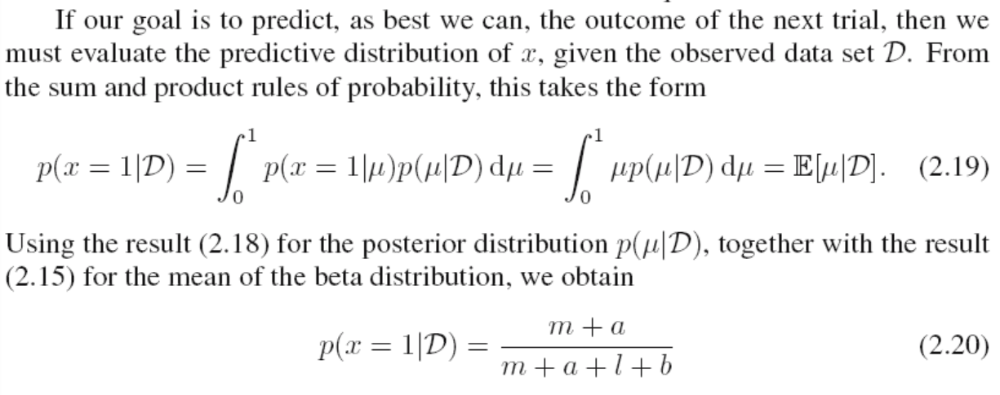
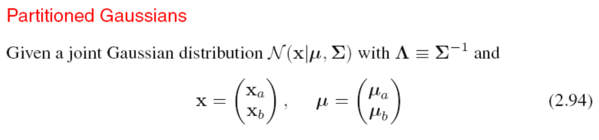
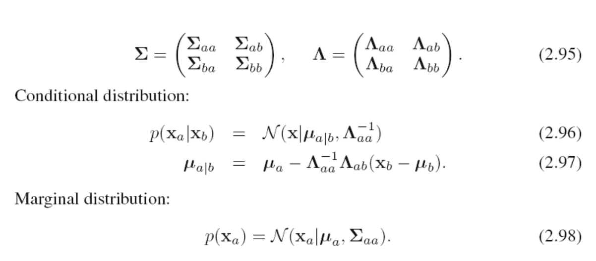
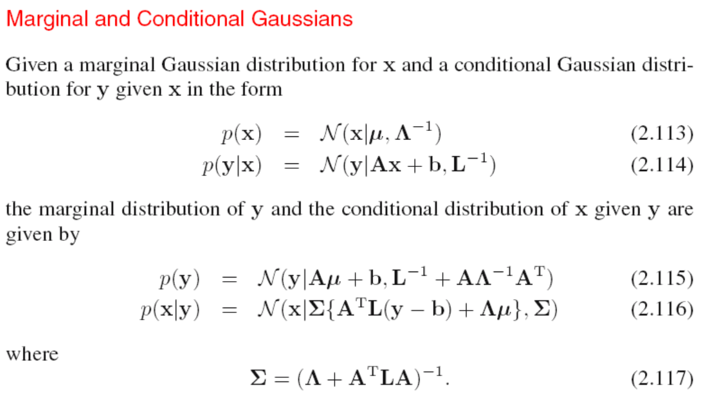

# PRML

---

### Introduction

- 高维拟合产生龙格震荡，数据size增大减小震荡

- over-fitting problem can be understood as a general property of maximum likelihood. By adopting a Bayesian approach, the over-fitting problem can be avoided.We shall see that there is no difficulty from a Bayesian perspective in employing models for which the number of parameters greatly exceeds the number of data points. Indeed, in a Bayesian model the effective number of parameters adapts automatically to the size of the data set
  $$
  p(w|D)=\frac{p(D|w)p(w)}{p(D)}
  \\p(D) = \int_Yp(D|W)p(W)dw
  $$
  D 是data, w是参数，贝叶斯避免过拟合的原因在于，他只有一个dataset，考虑所有参数的可能情况。与曲线拟合中通过大量可能的数据，通过一些estimator比如误差平方和来确定参数是相反的。

- 正则化，加入惩罚项以防止过拟合，在曲线fit中比较简单的方法是加入拟合参数的平和和
  $$
  E(w) = \frac{1}{2}\sum^N_{n=1}{[y(x_n,w)-t_n]^2}+\frac{\lambda}{2}||w||^2
  \\where ||w||^2 =w^Tw
  $$
  
- if we were trying to solve a practical application using this approach of minimizing an error function, we would have to find a way to determine a suitable value for the model complexity

#### Probability Theory

- Bayes' therorem
  $$
  p(Y|X)=\frac{p(X|Y)p(Y)}{p(x)}
  \\p(x) = \sum_Yp(X|Y)p(Y)
  $$

- 大数定理

  $E(f)=\frac{1}{N}\sum^N_{n=1}f(x_n) (N->\infin)$

- 条件期望

  $E[f|y] = \sum_xp(x|y)f(x)$

- 协方差

  $cov(x,y) = E_{x,y}[xy]-E[x]E[y]$

  for vector form

  $E_{x,y}=E_{x,y}[xy^T]-E[x]E[y^T]$

- 极大似然估计

  **估计的无偏性** 

  如果$\bar\theta是我们对于\theta$的估计，那么$E(\bar\theta)=\theta$我们说该估计是无偏的

  对于极大似然估计：

  

1. Bayes Treatment 

   **Given this definition of likelihood, we can state Bayes’ theorem in words**
    **posterior ∝ likelihood × prior**

   $p(t|x,X,t)=\int p(t|x,w)p(w|X,t)dw$

   where $p(t|x,w,\beta)=N(t|y(x,w),\beta^{-1})$

   Using Bayes’ theorem, the posterior distribution for w is proportional to the product of the prior distribution and the likelihood function

   so we have  $p(w|x,t,\alpha,\beta)\propto p(t|x,w,\beta)p(w|\alpha)$

#### model choice

- cross validation

  

- AIC,BIC

### probability distributions

- beta distribution

  首先先提及一下投硬币的问题，如果我们考虑成一个二项分布，假设硬币朝上的概率是$u$,那么如果有一个$D=\{x_1,x_2,...x_n\}$, 如果硬币朝上则x=1,否则为零，那么似然函数如下

  $p(D|u) = \prod_{n=1}^Np(x_n|u)=\prod_{n=1}^Nu^{x_n}(1-u)^{1-x_n}$ where $x_n=0or1$

  取对数后对u求导，能够推出

  $u_{ML}=\frac{1}{N}\sum_{n=1}^{N}x_n$

  容易看到，如果我连续3次都投出正面，那么由ML方法得到的正面概率就会是1，这是不合理的。因此我们需要对于参数$u$设置一个先验分布，由于贝叶斯公式后验分布正比于prior 与 likelihood function的乘积，因此后验分布会有和先验分布相同的函数形式，这就是conjugacy

  **beta distribution**
  $$
  Beta(u|a,b) = \frac{\Gamma(a+b)}{\Gamma(a)\Gamma(b)}u^{a-1}(1-u)^{b-1}
  \\E(u) = \frac{a}{a+b}
  \\var[u] = \frac{ab}{(a+b)^2(a+b+1)}
  $$
  这里a,b是超参数，因为他们控制着$u$的分布

  根据贝叶斯公式，我们可以得到后验分布

  $p(u|m,l,a,b)=\frac{\Gamma(m+a+l+b)}{\Gamma(m+a)\Gamma(l+b)}u^{m+a-1}(1-u)^{l+b-1}$

  

  

- Dirichlet distribution

  

- **conditional Gauss distribution**

  for $p(X_a|X_b)$

  $u_{a|b} = u_a+\sum_{ab}\sum_{bb}^{-1}(X_b-u_b)$

  $\sum{a|b}=\sum_{aa}-\sum_{ab}\sum_{bb}^{-1}\sum_{ba}$

  可以看到，条件概率下，期望是关于$X_b$的线性组合，方差与$X_b$无关

  

  

  矩阵转置公式
  $$
  \left[
  \begin{matrix}
  A & B\\
  C & D\\
  \end{matrix}
  \right]^{-1} =\left[ \begin{matrix} M&-MBD^{-1}\\
                                      -D^{-1}CM  &D^{-1}CMBD^{-1}\end{matrix}\right]
                                      \\where\quad M=(A-BD^{-1}C)
  $$

- **Bayes  theorem for Gaussian variables**

  