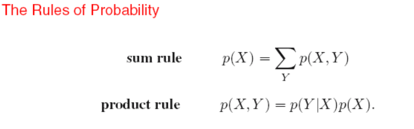

# PRML

---

### Introduction

- 高维拟合产生龙格震荡，数据size增大减小震荡

- over-fitting problem can be understood as a general property of maximum likelihood. By adopting a Bayesian approach, the over-fitting problem can be avoided.We shall see that there is no difficulty from a Bayesian perspective in employing models for which the number of parameters greatly exceeds the number of data points. Indeed, in a Bayesian model the effective number of parameters adapts automatically to the size of the data set这个不是特别理解

- 正则化，加入惩罚项以防止过拟合，在曲线fit中比较简单的方法是加入拟合参数的平和和
  $$
  E(w) = \frac{1}{2}\sum^N_{n=1}{[y(x_n,w)-t_n]^2}+\frac{\lambda}{2}||w||^2
  \\where ||w||^2 =w^Tw
  $$
  
- if we were trying to solve a practical application using this approach of minimizing an error function, we would have to find a way to determine a suitable value for the model complexity

#### Probability Theory

- Bayes' therorem
  $$
  p(Y|X)=\frac{p(X|Y)p(Y)}{p(x)}
  \\p(x) = \sum_Yp(X|Y)p(Y)
  $$

- 大数定理

  $E(f)=\frac{1}{N}\sum^N_{n=1}f(x_n) (N->\infin)$

- 条件期望

  $E[f|y] = \sum_xp(x|y)f(x)$

- 协方差

  $cov(x,y) = E_{x,y}[xy]-E[x]E[y]$

  for vector form

  $E_{x,y}=E_{x,y}[xy^T]-E[x]E[y^T]$

  