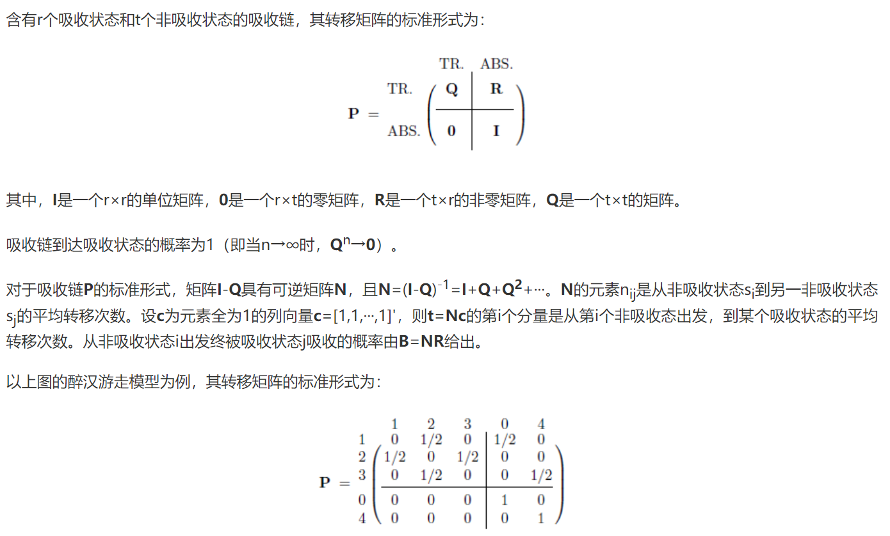
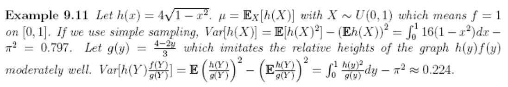
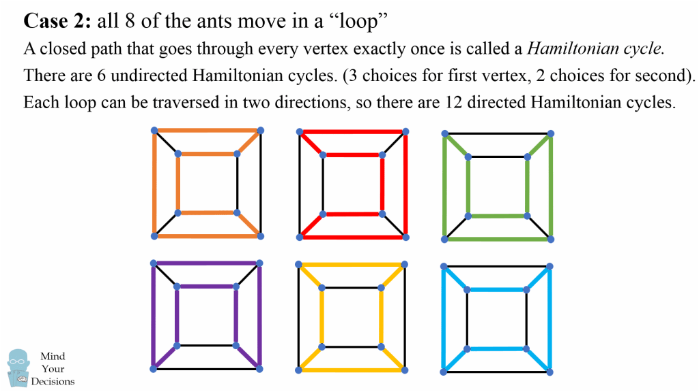
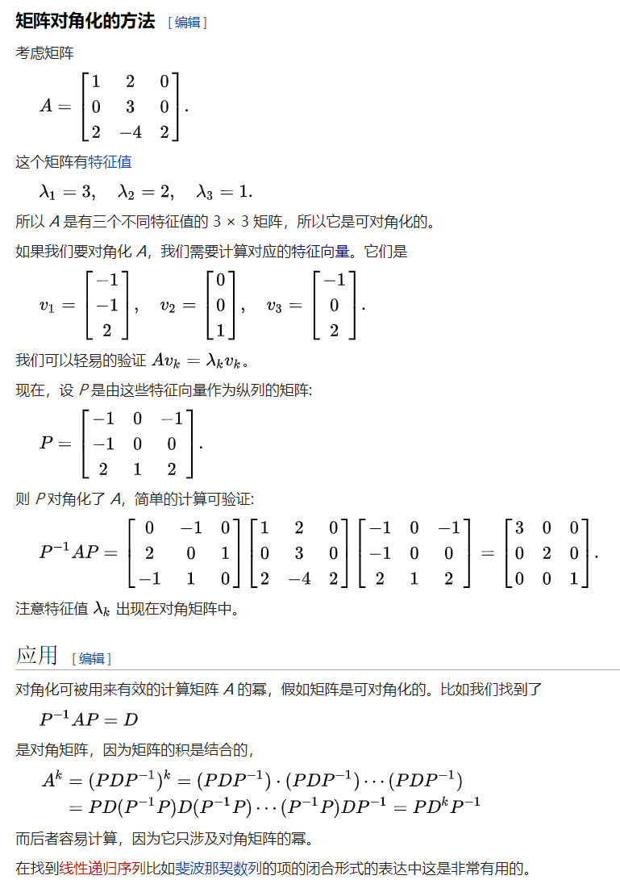
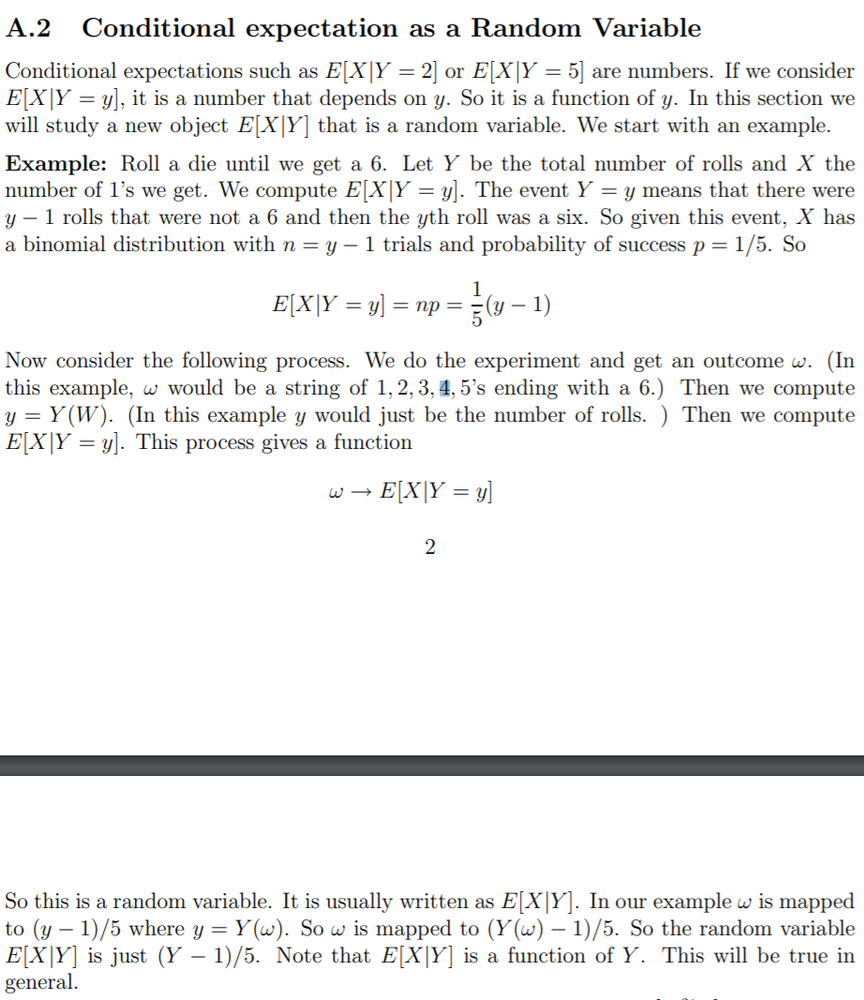
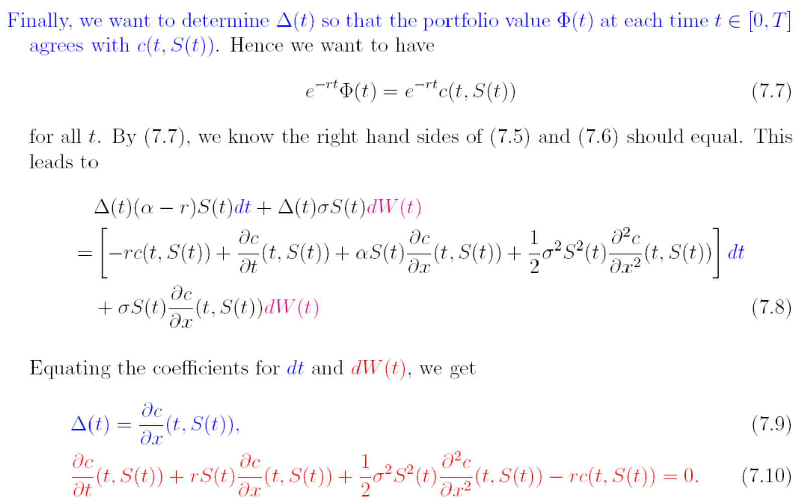
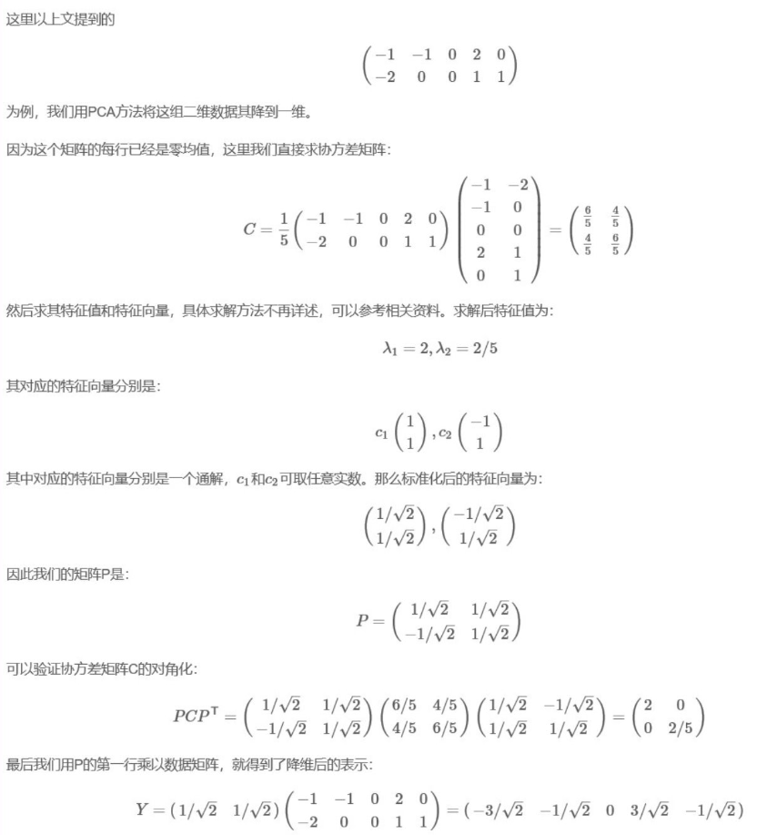

**Quant Job Interview Questions And Answer**

---

#### chapter 3 Probability

- Q 3.2: suppose we play a game, I roll die up to three times. Each time I roll, you can either take the number showing as dollars, or roll again. What is your expected winnings?

  ```latex
  For solve this question, this is like a American Option, we should consider whether we hold or we execute. Thus the payoff of the second roll is :
                    E[(first roll, E(roll_1))+] = (4+5+6)*1/6+3.5*1/2
  ```

- Q 3.4: We play a game: I pick a number n from 1 to 100. If you guess correctly. I pay you $n and zero otherwise. How much would you pay to play this game?

  ```
  what we should consider is a startegy which has noting with the number the player chosse, thus for example, you have P1 choose 1, P2 choose 2, P3 choose 3, no matter what probability you choose, for me they should be the same, means what I pay you is the same, Then we have:
                                    P1*1 = p2*2 = p3*3
                                    p1+p2+p3 = 1
  ```

  So the expected  pay is :
  $$
  \sum_{j=1}^{100}(\frac{1}{j})^{-1}
  $$

- Q 3.5 suppose you have a fair coin. You start with a dollar, and if you toss a H , your position doubles, if you toss a T, your position halves. What is expected value of the money you have if you toss the coin infinitely?

  For this question you should use:
  $$
  E[\prod_{i=1}X_{i}] = \prod_{i=1}E[X_{i}]
  $$

- Q 3.6  Suppose we toss a fair coin, and let N denote the number of tosses until we get a head(including the final toss). What is E(N) and Var(N)

  ```
  This question is not difficult, remember use E(N^2) to derive the Var(N) is ok. But this a Possian Process, So I want to review that here, the following use Chinese for convenience.
  ```

  For a Poisson Random Variable:
  $$
  P(x=k)=e^{-\lambda}\frac{\lambda}{k!},k=0,1,2   
  \\ E[X] = Var[X] = \lambda
  $$
  For Poisson Process
  $$
  E[N(t)] = D[N(t)] = \lambda t
  \\ C_{N}(s,t) = \lambda min(s,t)
  \\ P[(N(t+\tau)-N(t))=k] = \frac{e^{-\lambda \tau }(\lambda \tau)^{k}}{k!}
  \\ 性质：{N（t）}是参数为\lambda 的泊松分布当且仅当其时间间隔T1,T2独立同分布，且服从均值为1/\lambda 的指数分布
  \\ 主要运用P(T_{n}<t)=P(N(t)>n)
  $$

- Q 3.8 For a fair coin, what is the expected number of tosses to get three heads in a row?

  ```
  For this question, we introduce a method that very useful!
  ```

  $$
  E(X) = \sum_{n}E(X|B_{n})p(B_{n})
  \\考虑T,HT,HHT,HHH
  \\X = \frac{1}{2}(X+1) +\frac{1}{4}(X+2)+\frac{1}{8}(X+3)+\frac{1}{8}
  $$

##### Bayes Formula

- Q 3.10 ...

  the question is simple, I just want to remind you that the Bayes' theorem
  $$
  P(A_{i}|B) = \frac{P(B|A_{i})P(A_{i})}{\sum_{j=1}^{N}P(B|A_{j})P(A_{j})}
  $$

- Q 3.15 A family has two children of whom you know at least one is a girl. What is the probability that both are girls? what if you know that the eldest is a girl?

  **For this question**, you should pay attention that the two condition is different, the first don't mean there is difference between GB and BG !!


##### Markov question

- **Q 3.22**  suppose we have an ant traveling on edges of a cube, going from one vertex to another. The ant never stops and it takes him one minute to go along one edge. At every vertex to another. The ant randomly picks one of the cube and put the ant there. What is the expected number of minutes that it will take the ant to return to that same vertex?

  **This question is very classical question about Markov questions**
  $$
  这里我们复习关于马尔可夫链的极限分布，对于个马尔可夫转移矩阵
  \\定义 \pi_{j} 是不管链从什么状态i出发，通过长时间的转移，达到状态j的概率都是趋近于\pi_{j}
  \\ 对于极限分布求解\pi_{j} = \sum_{i=1}^{N}\pi_{i}P_{ij}
  \\但是这道题是一个带有吸收态的Markov链，一哥比较好的方法是迭代，先考虑事件空间，距离为0，1，2，3点
  \\ 设置f(n)为距离开始点n长度的回去的平均步长，这个题还是很类似上面的全概率期望
  \\ f(0) = 1+f(1)
  \\ f(1) = 1*\frac{1}{3}+\frac{2}{3}*(f(2)+1)
  \\ f(2) = \frac{2}{3}*(f(1)+1)+\frac{1}{3}*(f(3)+1)
  \\ f(3) = f(2)+1
  \\ f(0) = 8 , f(1) = 7, f(2)=9, f(3)=10
  $$
  
- **Q 3.23** You have been captured and blindfolded by pirates, then placed somewhere on a five-meter-long wooden plank. Disorientated, each step you take is a meter long but in a random direction- either toward the sharks waiting at one end or eventual freedom at the other.  decided every point the probability you survive

  ```
  pay attention this a Markov with two absorb state question, you can also use method above, here we use a theory about how to solve this question in Markov Matrix.For the last question, we can also use this method, we have start point as absorb point
  ```

  

  [Markov]: http://www.vartang.com/2013/02/%E5%90%B8%E6%94%B6%E9%A9%AC%E5%B0%94%E5%8F%AF%E5%A4%AB%E9%93%BE/

- Q 3.25 A plane has one hundred seats and there are exactly one hundred people boarding. They line up at the gate in exactly the same order as the order of the seats on the plane, from 1 to 100. However, the first person is Grandma who doesn't see well, so instead of taking the first seat on the plane, she picks a random seat and sit down. Now, the rule is: when any other person enters the plane, he or she will try to sit at his own seat. If this is not possible, this person chooses one of the free seats randomly. Eventually, everyone boards the plane. What is the probability that the last person will sit at his assigned seat number?

  ```
  This is a brain storm, you should consider for every person, if he seat for the 1, the last person can seat in the right seat, however, if he seat in 100, the person cannot seat in the right seat, if he choose 1-99, his state will transfer to the next person, thus we can know, if the last person should chose, there must only 1 and 100 seats left, so whether the last person can seat in the right seat is 1 or 100,thus the probability is 1/2
  ```

##### Positive define matrix
- Q **3.26**. Suppose three assets  A,B,C are such that the correlation coefficient of A and B is 0.9 and the correlation coefficient of B and C is 0.8, Is it possible for A and C to have correlation coefficient 0.1?

  **Answer:** this question has many concept to know, first is the positive define matrix!

  广义定义： 设M是n阶方阵，如果对任何非零向量z，都有
  $$
  Z^{T}MZ>0
  $$
  如何判断正定矩阵： 求出A的所有特征值，如果都为正即是正定矩阵

  实对称矩阵是正定矩阵的前提条件，或者求M的顺序主子式的行列式均为正数。实对称矩阵有正定，负定等等

  下面需要证明，相关系数矩阵一定是半正定矩阵：
  $$
  如果我有以下组合
  \\ Y = a_{1}X_{1}+a_{2}X_{2}+...a_{n}X_{n}
  \\则 Y的方差是a^{t}Ca一定是大于等于0的，因此相关系数矩阵半正定
  $$
  这个题也可以从另外一个角度考虑，甚至可以求出另外一个相关系数的范围。首先要理解，相关系数实际上可以理解成两个向量的cosin值，可以看下面这个链接：

  [cosin]: https://www.johndcook.com/blog/2010/06/17/covariance-and-law-of-cosines/

  那么可以通过反三角函数来算出第三个值的范围，但是这个感觉不是很靠谱，这个题通过正定来求解，可以推出范围在（0.458，0.982）

- **Q 3.27** let x,y be uniformly distributed on [0,1] and separate the unit interval [0,1] into 3 pieces, what is the probability that the 3 pieces of the line can be constructed into a triangle?

  **Answer:**  we directly consider for a line , if we cut n times and cut it into n+1 pieces, what is the probability for it to construct a n+1-gon?

  First we should know that for a n+1-gon, if we have a<b<c<....m, we must have a+b+c+....>m

  and we also have a+b+c+....m = 1

  so we can know, if there exist a line >= 1/2, the (n+1)-gon can not be constructed. so we consider the probability that there exist a line >=1/2 , this is equal to all the cut locates the half of the line, thus the probability is 1/2^n. and we have n+1 pieces, so the probability is  (n+1)/2^n,

  thus the  probability can constructed agon is    $1- (n+1)/2^n$

##### kth order statistic 
- Q 3.29  kth order statistic

  Firstly we analyze Max and Min
  $$
  P(max(x_{i})<X)  \quad\forall i \quad x_{i}<X
  \\ P(max(x_{i}<X)) = \prod_{i}P(x_{i}<X) = F(X)^{n}
  thus P(min(x_{i}<X)) = 1-(1-F(x))^{n}
  \\ Kth\quad order: P(x_{k}<x) = \sum_{j=k}^{n}C_{n}^{j}(F(x))^j(1-F(x))^{n-j}
  \\ Thus:\frac{d}{dx}P(x_{k}<x) = \frac{n!}{(n-k)!(k-1)!}f(x)F(x)^{k-1}(1-F(x))^{n-k}
  $$
  Knowledge compensation:
  
##### exponential and Cauchy distribution
  **exponential distribution:**

  - $$
    F(x;\lambda)=\left\{
    \begin{array}{rcl}
    1-e^{-\lambda x} & & {x>=0}\\
    0 & & {x<0}
    \end{array} \right.
    $$

  **Cauchy distribution**
$$
  f(x;x_{0},\gamma) = \frac{1}{\pi}[\frac{\gamma}{(x-x_{0})^{2}+\gamma ^{2}}]
  \\ when\quad \gamma =1,x_{0}=0\quad被称为标准柯西分布
  \\ 其方差和数学期望都是不存在的
$$

- Q 3.31 Suppose the random X has a probability density function $f_{X}(x)$. What density function does g(X) have?

  **Answer :** this is a very typical expectation question, as the following
  $$
  P(g(X)<x) \leftrightarrow P(X<g^{-1}(x))
  \\\frac{d}{dx}P(g(X)<x) = \frac{d}{dx}\int_{-\infin}^{g^{-1}(x)}f(x)dx=f(g^{-1}(x))\frac{d}{dx}g^{-1}(x)
  $$

- **Q 3.33** Let X and Y be two independent uniform random variables on the unit interval [0,1]. What is the probability density function of X+Y

  **Answer**: for this type question ,you should have a very clear flow to solve that, otherwise you will lose some condition.
  $$
  Definition:P(X+Y\leq z) = P(X+Y\leq z|Y=y)g(y)dy
  \\=P(X\leq z-y)g(y)dy=\int_{-\infin}^{\infin}\int_{-\infin}^{z-y}f(x)g(y)dxdy
  \\h(z) = \int_{-\infin}^{\infin}f(z-y)g(y)dy
  \\因此我们需要讨论z-y和y的范围来进行积分，这就是最重要的地方了
  \\g(y)=\left\{
  \begin{array}{rcl}
  1 & & {0\leq x\leq1}\\
  0 & & {otherwise}
  \end{array} \right.
  
  \\f(z-y)=\left\{
  \begin{array}{rcl}
  1 & & {z-1\leq y\leq z}\\
  0 & & {otherwise}
  \end{array} \right.
  \\h(z) = \int_{max(z-1,0)}^{min(z,1)}1dy
  $$
  

  knowledge compensation:
##### Central Limit theorem
  Central Limit theorem :
$$
  设随机变量X_{1},X_{2},....X_{n}..独立同分布，并且有有限的数学期望和方差，那么有
  \\\lim_{n\rightarrow \infin}F_{n}(x) = lim_{n\rightarrow \infin}(\frac{\sum_{i=1}^nX_{i}-n\mu}{\sigma \sqrt{n}})\leq x)= \phi(x)
$$

- **Q 3.36** Explain change of measure. Give an example when a change of measure is useful in Monte Carlo
##### Change of measure
  Stochastic Review:


$$
\mu = Eh(X)=\int_Rh(x)f(x)dx=\int_Rh(x)\frac{f(x)}{g(x)}dx = \int_Rh(y)\frac{f(y)}{g(y)}dy = E(h(Y)\frac{f(Y)}{g(y)})
$$



- **Q 3.38** If M(x) is the cumulative Gaussian function and X is N(0,1) the what is E[M(x)]

  **Answer: one tips, you integral an odd function, you always get a zero**

  $$
  E[M(x)] = \int_{-\infin}^{\infin}M(x)f(x)dx
  \\ M(x) = 1-M(-x)
  \\ definte\quad g(x) = M(x)-\frac{1}{2}
  \\g(-x)= M(-x)-\frac{1}{2}=(1-M(x))- \frac{1}{2} = \frac{1}{2}-M(x)=-g(x)
  \\E[M(x)] = \int_{-\infin}^{\infin}(M(x)-\frac{1}{2}+\frac{1}{2})f(x)dx=\int_{-\infin}^{\infin}g(x)f(x)dx+\int_{-\infin}^{\infin}\frac{1}{2}f(x)dx = 1/2
  
  \\顺带一提 P(M(X)\leq x) = P(\phi(X)\leq x) = P(X\le \phi^{-1}(x))=\phi(\phi^{-1}(x))=x
  \\说明 M(x)在 0-1上呈现均匀分布，因此均值为1/2
  $$
  
- Q 3.41 Given a coin, how do you use it to choose one out of three events? What is the average number of tosses you need to do this?

  **Answer:** you toss twice, if you get "TT", then, re-toss. For the Average number, we consider that we tosses twice as one toss, the probability of right is 3/4, and the probability of re-toss is 1/4. Thus  the question change to :  *you have a bias coin, what the expect number of you to get a T with once p=3/4?*

  use  $x = \frac{1}{4}(x+1)+\frac{3}{4}*1 \rightarrow x= \frac{4}{3}$

  thus the number of us is $\frac{8}{3}$ 

  **thus you can the key of this type of question is you make your own rule and then you change the question as the type you familiar with**

##### geometric distribution

**the times you take of the first success**

 $P(x=k) = (1-p)^{k-1}p$

conclusion : $E(k)=\frac{1}{p}\quad Var(k) = \frac{1-p}{p^{2}} $

*here I just want to show you a more simple way to solve a sum* 

$E(k) = p*(1+2q+3q^{2}+4q^{3}+....+kq^{k-1})=p*(q+q^{2}+q^{3}+...q^{k})^{'}=p*(\frac{q}{1-q})^{'}=\frac{1}{p}$

##### Bi-distribution

**n times independent experiment, the times of success**

$p（x=k)=C_{n}^{k}p^{k}(1-p)^{n-k}$

conclusion: $E(k)=np, Var(k)=np(1-p)$

- Q 3.44. Draw 3 cards from a deck of 52 cards(no jokers). Observe the value of the 3 cards, then replace the card with the lowest value with another card in the deck. What is the expected value of the 3 cards? Assume the value of a jack is 11, queen is 12, king 13?

  **Answer:** Firstly you should mathematically think about this question:

  Transfer this question to as the followings:

  $E(x_{1}+x_{2}+x_{3}+x_{4})-E(min(x_{1},x_{2},x_{3}))$

  so how to solve the min, we have faced this question before.

  but how to solve a discrete non-negative random variable? Here you should know about this equation
  
  $E(x)=\sum_{x=0}^{\infin} xp(X=x)=\sum_{x=0}^{\infin} p(X>x)$
$$
我们可以证明上面的等式，他是一个很重要的结论
  \\E(X)=\sum_{x=0}^{\infin}xp(X=x)=\sum_{x=0}^{\infin}x(p(X>x-1)-p(X>x))
  \\=\sum_{x=1}^{\infin}x(p(X>x-1))-\sum_{x=1}^{\infin}(x-1)p(X>x-1)
  \\=\sum_{x=1}^{\infin}p(X>x-1) =\sum_{x=0}^{\infin}p(X>x)
  \\换一边我们同样可以证明
  \\E(x)=\sum_{n=0}^{\infin}p(X>n) =\sum_{n=0}^{\infin}\sum_{x=n+1}^{\infin}p(X=x)=\sum_{x=0}^{\infin}\sum_{n=0}^{x-1}p(X=x)=\sum_{x=0}^{\infin}xp(X=x)
$$
  thus, for this question, we denote m as the min of (x1,x2,x3), thus we know

  $P(m<k)= 1-(1-\frac{k-1}{13})^{3}, P(m\geq k)=(\frac{k-1}{13})^{3}$ use the conclusion above, use also the following

  ​                                                                         $\sum_{k=1}k^{3}=(\sum_{k=1}k)^{2}$

  

- Q 3.48. Three ants on different corners of triangle. Each chooses a direction of travel randomly and they all travel at the same positive speed. What is the probability of no collision?

  **Answer**:  this question is very simple, because the only case is that they go the same direction so for a triangle the probability is 1/4.  Now you should consider a cube with 8 ants on the corner of the cube.

  then total is $3^{8}$ situation. 

  case 1:  face to face,  every face has 2 direction, and you have 3 pairs, thus $2*2*3=12$

  case 2: Hamiltonian cycles. 12 

  

- Q  3.50 There are 10 red, 20 blue, and 30 green balls in a bag. You keep taking one out at random. What is the probability that when you take the last red one out, there is at least one blue and one green ball still in the bag?


- Toss a coin N times what is the probability that there are no HH sequences?

  **Answer:** With N coin tosses, there are $F_{N+2}$ different possible outcomes such that there are no two consecutive heads. $F_{N}$ is the Nth Fibonacci number.

  how it could be!!

  just like dynamic programming:

  F(N) 代表丢N次，产生没有HH的序列的个数，那么F（N）应该由什么组成，用frist分析，第一次是T，那么剩下F（N-1）,如果第一次是H，那么第二次的必定要是T，剩下的就是F（N-2）,所以我们有

  F（N）=F(N-1)+F(N-2)​

  如果是HHH序列，那么应该就是$F(N)=F(N-1)+3F(N-2)$

  如果是骰子，那么不出现连续两个6的序列是：$F(1)=6, F(2)=35, F(N)=5F(N-1)+5F(N-2)$

##### eigenvector or characteristic vector

$$
特征值求解与特征向量的求解：
\\ (A-\lambda I)x=0
\\ 先令上式行列式值为零，得到\lambda 值后再求解出x得到特征向量
$$



- Q 3.54  Let X and Y be two Gaussian random variables with distributions N(0,a) and N(0,b), respectively. Suppose that X and Y are correlated with correlation $\rho$ , What is E[X-Y|2X+Y]?

  **Answer**: how we view the conditional expectation? the following will give you a specific explain:

  

  to solve that we mainly use some property of conditional expectation

  $E[aX+bZ|Y]=aE[X|Y]+bE[Z|Y]$

  so $E[Z_{1}+Z_{2}|Z_{1}+Z_{2}]=E[Z_{1}|Z_{1}+Z_{2}]+E[Z_{2}|Z_{1}+Z_{2}]=Z_{1}+Z_{2}$

  according the symmetry between Z1 and Z2

  $E[Z_{1}|Z_{1}+Z_{2}]= \frac{Z_{1}+Z_{2}}{2}$
  $$
  W_{1} = aZ_{1} \quad W_{2} = bZ_{2}
  \\E[W_{1}|W_{1}+W_{2}] = \frac{a(W_{1}+W_{2})}{a+b}
  \\X = aZ_{1} \quad Y = b(\rho Z_{1}+\sqrt{1-\rho^{2}}Z_{2})
  \\将X,Y带入 W1,W2从而可以求得答案
  $$

##### Brownian motion

$W_{0}=0,s<t, W_{t}-W_{s} normally\;distributed\;with\;mean\;zero\;and\;variance\;t-s $

- Q 3.56 Suppose we are doing a random walk on the interval [0,1000],starting at 80, So with probability 1/2, this number increases or decreases by one at each step. We stop when one of the boundaries of the interval is reached. What is the probability that this boundary will be 0?

  **Answers:** this is obviously a martingale, so E(x_t|t=0) = x0=80 = 1000p+0*(1-p), so that we can solve p and the probability we want is 1-p

- Q 3.58 Suppose you have a call option on the square of a log-normal asset. What equation does this price statisfy?

##### Black-Scholes-Merton equation



- Q 3.64 Given two independent Brownian motions $W_{t}$ and $Z_{t}$， what is the distribution of $\frac{W_{t}}{Z_{t}}$? What stochastic differential equation is satisfied by the ratio?

- **Answer:** 
  $$
  P(\frac{W}{Z}\le u) = \int_{-\infin}^{\infin}P(\frac{W}{Z}\le u|Z=z)P(Z=dz)
  \\=\int_{-\infin}^{0}P(W\ge zu)P(Z=dz) +\int_{0}^{\infin}P(W\le zu)P(Z=dz)
  \\接下来对u求导，得到目标函数的密度函数，注意这里求导并不消除积分符号，因为求导变量与积分变量没有关系
  \\f(\frac{W}{Z}) = \int_{-\infin}^{\infin}|z|\phi(zu)f(z)dz=\frac{1}{\pi}\frac{1}{\mu^{2}+1}
  \\可以看到，两个标准布朗运动的商是标准柯西分布！！！
  $$

- Q 3.67 if we have a Brownian motion, $X_{t},X_{0}=0,X_{1}>0$ , What is the probability $X_{2}<0$?

  **Answer:** consider how to satisfy this condition

  we should have $X_{2}-X_{1}<0$ direction  and $|X_2-X_1|>X_1=X_1-X_0$ magnitude and all of this is 1/2, thus the answer is **1/4**

- Q 3.69 how to answer that the Ito lemma is right?

  **Answer:**  use Taylor expand for f(t,Xt), and high order dt term will be zero at all

##### Principal component analysis

change the x-y axis,you consider that you have many points, you want to use one axis to denote them, how can you choose a axis?

STEP:

-  you have a matrix with n row and m column, we assume that the attribute is row, and columns indicates you have how many samples
- thus, zero-score in every row 
- get the covariance matrix $C = \frac 1mXX^T$
- solve the eigenvalues and eigenvectors, because for covariance matrix, the eigenvectors are Orthogonal, which you can use the eigenvectors to create the orthogonal base
- according to the eigenvalues arrange the the eigenvectors by row
- $Y=PX$ then get the low-dimension data as we want



Q 3.71 If $N_t$ is a Poisson process with parameter $\lambda$,what is $E(N_{t2}|N_{t1}=k)$ where $t_2>t_1$?

##### Poisson process

- $X(0)=0$
- $X(t)$是独立增量过程
-  对任一长度为t的区间时间的个数服从参数为$\lambda t$的泊松分布，即 $P(X(t+s)-X(s)=k)=\frac{(\lambda t)^k}{k!}*exp(-\lambda t)$
- 性质 $E(X(t))=Var(X(t))=\lambda t$

for this question, the answer is very obvious


Q 3.73 What is the probability that a Brownian motion will cross the level 1 before time T?

##### Reflection Principle

$$
P(W(t)\ge m+\Delta x|W(t_0)=m)=P(W(t)\le m-\Delta x|W(t_0)=m)
\\for\quad m>0\quad W(t_0)\leftrightarrow W^*_t\ge m 
\\ P(W(t)\ge m+\Delta x|W^*_t\ge m )=P(W(t)\le m-\Delta x|W^*_t\ge m)
\\对条件概率使用贝叶斯公式：
\\P(W(t)\ge m+\Delta x,W^*_t\ge m )=P(W(t)\le m-\Delta x,W^*_t\ge m)
\\equal\quad P(W(t)\ge m+\Delta x)=P(W(t)\le m-\Delta x,W^*_t\ge m)
\\P(W^*_t\ge m,W_t\le w) = P(W_t\ge2m-w)
$$

for this question, 

we want $P(W^*_t>1)=P(W^*_t>1,W_T<1)+P(W^*_t>1,W_T>1)=2P(W_T>1)$

use the Principle, we can even conduct the density function of W*

we have the just like the above:

$P(W^*_t>m)=P(W^*_t>m,W_T<m)+P(W^*_t>m,W_T>m)=2P(W_T>m)$

$$
stoping\;time: \tau_, = inf{s:W(s)=m}
\\then:\quad P(\tau _m\le t) = P(W^*_t\ge m)
\\P(\tau_m\le t,W_t\le w) = P(W_t\ge2m-w)
$$
Q 6.3 Find the closed-form solution of the Fibonacci sequence

special root method:

if there are two different root of the equation $\alpha\; \beta$

$a_n = C_1\alpha^n+C_2\beta^n$

if there are two the same root of the equation

$a_n = (C_1+C_2)\alpha^n$


##### Tayor expand

$f(x) = \frac{f(x_0)}{0!}+\frac{f(x_0)'}{1!}(x-x_0)+\frac{f(x_0)''}{2!}(x-x_0)^2+O(x)$


Q 6.16 Does $\sum_{n=1} ^\infin n^{-1} converge? why?$

proof: 

$s = 1+\frac 12+\frac 13+...=\int_1^2dx+\int_2^3\frac12dx+\int_3^4\frac 13dx+...$

$\ge\int_1^{n+1}\frac 1xdx=ln(x)|^{n+1}_1$


Q 6.17 transform the Black-Scholes equation into the heat equation.